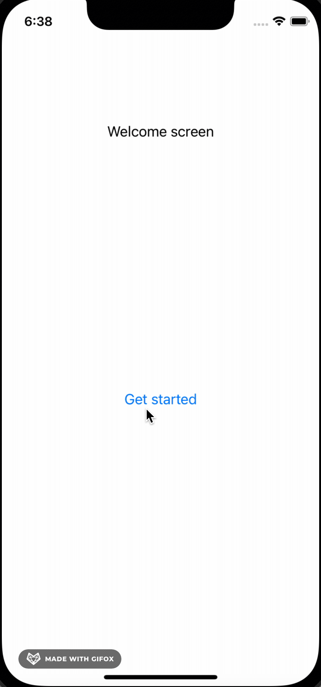

# Add Flutter to existed App
This project using flutter 2.8.0 stable and cocoapods 1.11.2

An example project add flutter module to an existed application with native platform.
Android integration update later.

