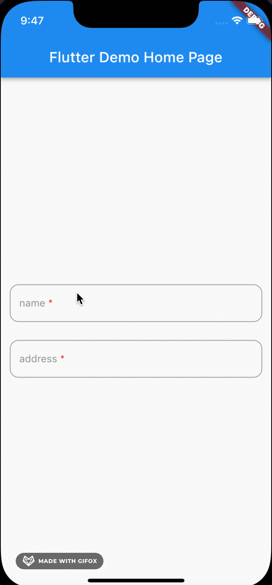

# Keyboard Action demo

This project uses flutter 2.8.0 stable.

As you know Flutter hasn't supported you to customize keyboard toolbar yet. This demo shows you how to basicly create a
keyboard toolbar.

This demo is the most basic implementation. You guys can customize it to fit your own project.

Checkout Overflow Text Form Field demo [here](https://github.com/wamynobe/Flutter-Notebook/tree/main/overflow_text_field)

